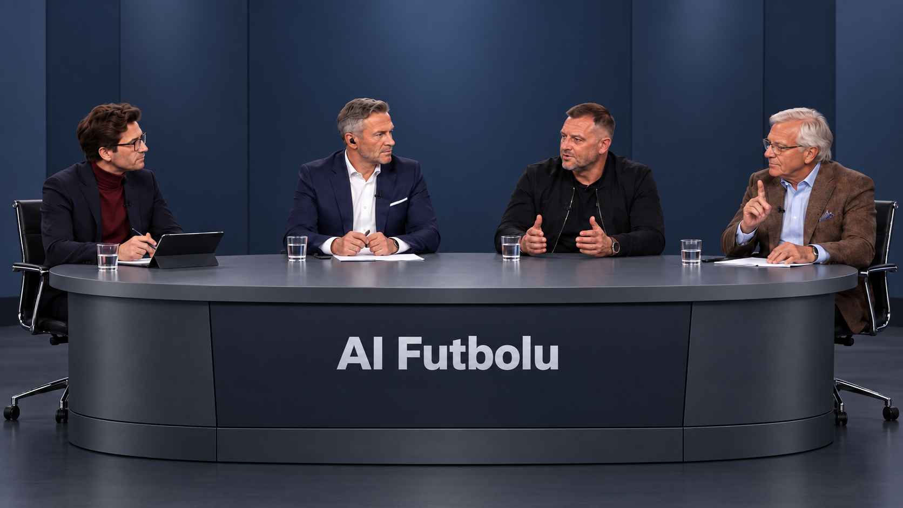

# AI Futbolu

Cztery czatboty AI siedzą na fotelach i rozmawiają o piłce. Wszystkie pustosłowia, aforyzmy i pozbawione treści anegdotki w nowatorskiej formule.



https://github.com/user-attachments/assets/ac2d522a-abff-4756-8e8a-e69e1237b9f9

[Download the full episode](episode-1/episode-1.mp4) · [Read the transcript](episode-1/episode-1.md)

## Pipeline

```text
personas + topic → individual research → directed discussion → Polish fixes
                → dialogue audio + turn timings → close-ups + wide shots
                → assembly → subtitles + watermark
```

| Stage | What we went with | Why |
|---|---|---|
| Cast | Four fictional media archetypes in `personas/` | Recognizable pundits, not copies of four real people. Nobody knowingly performs comedy. |
| Discussion | Claude hosts; Grok is the ex-player; DeepSeek is the analyst; Codex is the columnist | Separate models give the panel different voices. Each researches from his own angle and receives the conversation so far. |
| Direction | Jev / TypeSafe probabilities, with code handling turn order, interruptions and limits | The models write the lines; a separate director keeps the conversation moving. |
| Audio | ElevenLabs text-to-dialogue, Jev delivery tags, pronunciation aliases | Multi-speaker delivery without changing the displayed Polish text. Chunk caching limits re-rendering. |
| Video | Hedra Character 3 close-ups; shared animated wide shots | Long turns get lip-sync at the beginning and end. The wide shot covers the middle to limit cost. |
| Finish | FFmpeg, surname-labelled SRT/ASS subtitles, watermark | Local assembly. Caption timing within a turn is approximate, not word-aligned. |

## Files

| Path | Contents |
|---|---|
| `episode-1/` | Final video, JSONL and readable transcripts, turn timings, SRT and ASS subtitles |
| `personas/`, `assets/` | Character instructions, portraits, studio image and watermark |
| `config.toml`, `voices.toml` | Episode, cast, models, direction, rendering and voice settings |
| `pipeline/` | Research, direction, discussion, Polish fixes, audio, video and subtitles |
| `tools/` | `finish.sh` for local finishing; `trim.py` for dropping leading audio turns |

## Setup

Python 3.12+, [uv](https://docs.astral.sh/uv/), FFmpeg/ffprobe with libass,
and Liberation Sans. Install the service CLIs separately and put them on `PATH`.

| CLI | Tested version | Authentication |
|---|---|---|
| `claude` | 2.1.284 | `claude auth login` |
| `codex` | 0.158.0 | `codex login` |
| `grok` | 1.0.44 | Its CLI login |
| `elevenlabs` | 1.4.0 | `elevenlabs auth login` |
| `hedra-cli` | 7.0.0 | `hedra-cli auth login` |

```sh
uv sync --frozen
cp .env.example .env
# Fill OPENROUTER_API_KEY and TYPESAFE_API_KEY; log in to the CLIs above.
```

Set your ElevenLabs voice IDs in `config.toml`. Episode-specific cues are in
`pipeline/room.py` and `pipeline/director.py`.

### Offline checks

```sh
uv run pipeline/room.py --dry-run --minutes 1 --out transcripts/smoke.jsonl
uv run pipeline/voice.py episode-1/episode-1.jsonl --dry-run
uv run python -m unittest discover -s tests
```

Audio dry runs skip delivery selection.

### Generate

Paid generation. `--budget` uses the rate in `config.toml`.

```sh
uv run pipeline/room.py --out transcripts/episode-1.jsonl
# Review the transcript before rendering audio.
uv run pipeline/voice.py transcripts/episode-1.jsonl
uv run pipeline/video.py plan episode-1
uv run pipeline/video.py ambient episode-1 --yes
uv run pipeline/video.py render episode-1 --turns 0,1 --budget 3
uv run pipeline/video.py assemble episode-1 --until 60
```

Keep `audio/` and `video/` to reuse cached chunks and jobs. `--redo` regenerates
selected clips. Missing close-ups use wide shots.

### Finish locally

```sh
uv run pipeline/video.py assemble episode-1
uv run pipeline/subtitles.py audio/episode-1.timing.json video/episode-1
./tools/finish.sh episode-1
# Result: video/episode-1.final.mp4; refuses to overwrite an existing file.
```

Captions from the published timings:

```sh
uv run pipeline/subtitles.py episode-1/episode-1.timing.json video/episode-1
```
